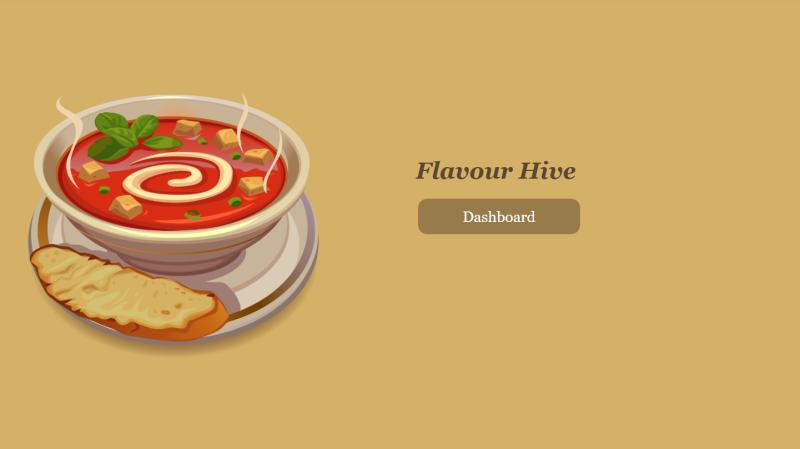
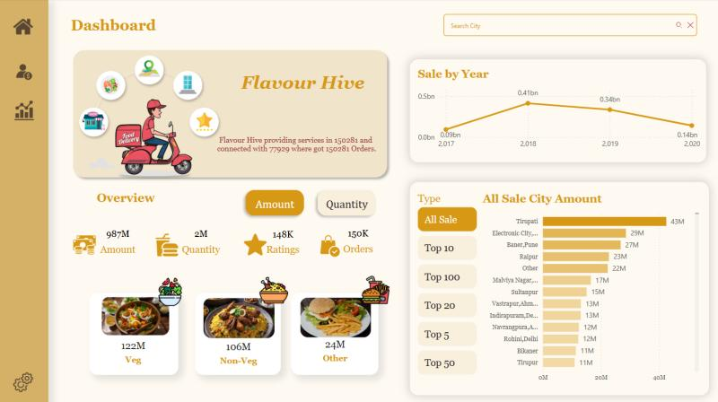
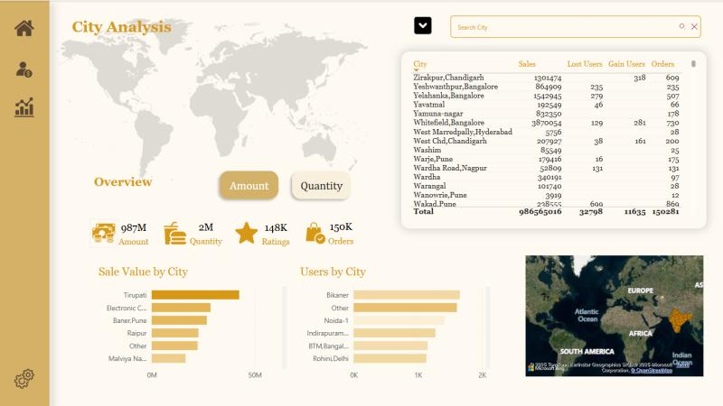
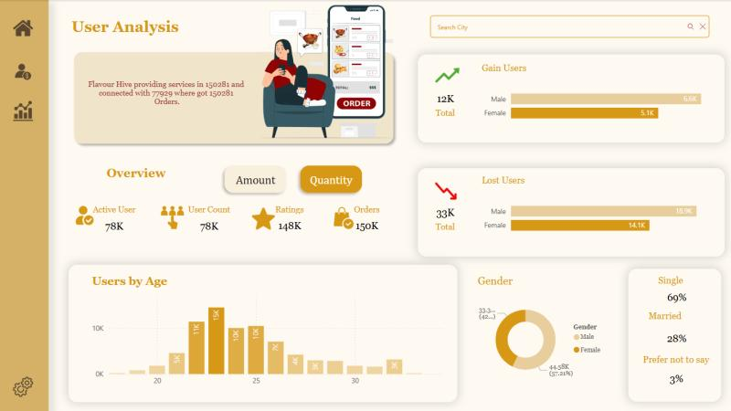

# Flavour Hive Power BI Dashboard

## Project Overview

This project presents an interactive **Power BI dashboard** for analyzing sales, user behavior, and city trends for a food delivery platform *Flavour Hive*.
It provides insights into sales performance, user behavior, and city-level trends.

## Topics

Power BI, Data analytics, dashboard, DAX, Business Intelligence
---

## Features

* City-wise sales analysis
* Yearly sales trends
* User gain & loss analysis
* Ratings and order insights
* Category-wise performance (Veg, Non-Veg, Others)

---

## Project Structure

```
Flavour-Hive-PowerBI/
├── Report/           # Power BI report files
├── *.pbip            # Power BI Project file
├── README.md
```

---

## Dashboards

### 1. Dashboard

* Index page to redirect other dashboards
  
### 2. Sales Dashboard

* Total Amount: 987M
* Total Orders: 150K
* Sales trend from 2017–2020
* Top-performing cities

### 3. City Analysis

* Sales by city
* User distribution by location
* Gain & loss users per city

### 4. User Analysis

* Active users: 78K
* User demographics (age, gender, marital status)
* Gain vs Lost users breakdown

---

## Tools Used

* Microsoft Power BI Desktop
* Data Modeling & DAX
* Power Query (ETL)

---

## Dataset

* Contains sales, user, and city-level data
* Includes:

  * Orders
  * Revenue
  * User activity
  * Ratings

[(Dataset)](https://drive.google.com/drive/u/1/folders/1__rStAFMHVUk4qcvS8wg-_rfR9KUM80j)

---

## Key Insights

* Majority of revenue comes from top-tier cities
* High user drop observed in specific regions
* Peak sales recorded in 2018
* Veg category contributes highest revenue

---

## How to Use

1. Download the project
2. Open `.pbip` file in Power BI Desktop
3. Refresh dataset if needed

---

## Author

**Saranja Navaneethakumar**

---


